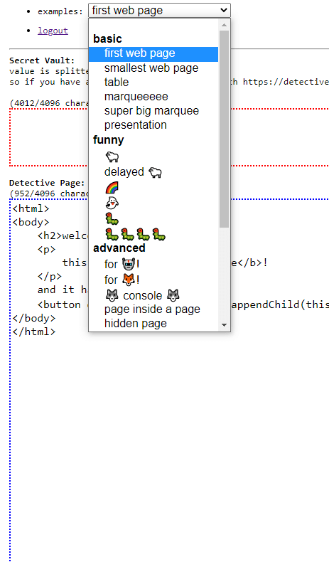

# [https://detective.ninja](detective.ninja)

This is a project to teach kids how to code by creating a
constrained environment and fostering creativity. It is about you
sitting with your kids and coding something small and exciting. It
assumes you know how to code, but the help section has some topics
for discussion. It is basically a playground with examples.

